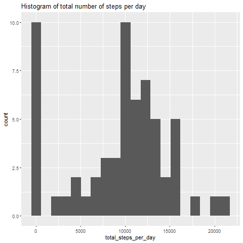
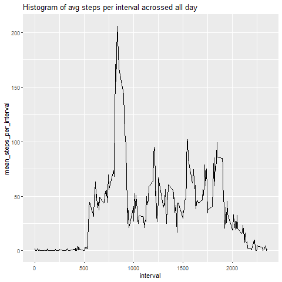
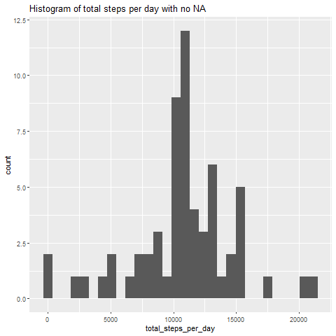

**loading required package**
```{r,results='hide'}
library(tidyverse)
library(tibble)
library(lubridate)
library(knitr)
library(markdown)
library(rmarkdown)
```

**Loading and preprocessing the data:**

*step1:Loading data*
```{r repData}
Repdata <- as_tibble(read.csv("E://Analysis Projects/activity.csv"))
```

*step2:Proccessing data into suitable format*
```{r}
Repdata$date <- as.Date(Repdata$date,"%Y-%m-%d")
```

**Q1: What is mean total number of steps taken per day?** 

*step1: Making a histogram of the total number of steps taken each day*
```{r,results='hide'}
steps_per_day <- Repdata%>%
     group_by(date)%>%
     summarize(total_steps_per_day=sum(steps,na.rm=T))%>%
     ungroup()
```

```{r}
steps_per_day%>%
     ggplot(aes(total_steps_per_day))+
     geom_histogram(bins = 20)+
     labs(title = "Histogram of total number of steps per day")
```


*step2: Calculating mean and median total number of steps taken per day:*
```{r}
mean(steps_per_day$total_steps_per_day)
median(steps_per_day$total_steps_per_day)
```

**Q2: What is the average daily activity pattern?**  

*Step1: Make a time series plot (i.e. type = "l") of the 5-minute interval (x-axis) and the average number of steps taken, averaged across all days (y-axis)*
```{r,results='hide'}
steps_per_interval <- Repdata%>%
          group_by(interval)%>%
          summarize(mean_steps_per_interval=mean(steps,
                                                na.rm=T))
```
```{r}
steps_per_interval%>%
    ggplot(aes(interval,mean_steps_per_interval))+
    geom_line()+
    labs(title = "Histogram of avg steps per interval acrossed all day")
```


*step2: finding which 5-minute interval, on average across all the days in the dataset, contains the maximum number of steps*
```{r}
max_steps <- steps_per_interval%>%arrange(desc(mean_steps_per_interval))
max_steps$interval[1]
```

So from this we can say on average 835-840 interval has the highest steps count among all intervals.

**Q3: Imputing missing values**

*step1:Calculate and report the total number of missing values in the dataset*
```{r}
sum(is.na(Repdata$steps))
```
So there are 2304 missing values in the dataset.

*step2: Devise a strategy for filling in all of the missing values in the dataset. The strategy does not need to be sophisticated*
```{r,results='hide'}
#steps=ifelse(is.na(steps),mean(steps,na.rm=T),steps)

```

*step3:Creating a new dataset that is equal to the original dataset but with the missing data filled in*
```{r}
converted_repdata <- Repdata%>%
     group_by(interval)%>%
     mutate(steps=ifelse(is.na(steps),mean(steps,na.rm=T),steps))%>%
     mutate(steps=ifelse(is.na(steps),0,steps))
converted_repdata
```

*step4: Make a histogram of the total number of steps taken each day*
```{r}
converted_repdata%>%
     group_by(date)%>%
     summarize(total_steps_per_day=sum(steps))%>%
     ungroup()%>%
     ggplot(aes(total_steps_per_day))+
     geom_histogram()+
     labs(title = "Histogram of total steps per day with no NA")
```


*and Calculate and report the mean and median total number of steps taken per day. Do these values differ from the estimates from the first part of the assignment? What is the impact of imputing missing data on the estimates of the total daily number of steps?*
```{r}
steps_per_day_noNA <- converted_repdata%>%
          group_by(date)%>%
          summarize(total_steps_per_day=sum(steps))%>%
          ungroup()
```

```{r}
mean(steps_per_day_noNA$total_steps_per_day)
median(steps_per_day_noNA$total_steps_per_day)
```
Here we see mean is equal to the median. but both mean and median increased after the NA value is replaced.

**Q4: Are there differences in activity patterns between weekdays and weekends?**

*step1:Create a new factor variable in the dataset with two levels -- "weekday" and "weekend" indicating whether a given date is a weekday or weekend day.*
```{r}
converted_repdata$days <- weekdays(converted_repdata$date)

converted_repdata_withDays <- converted_repdata%>%
        mutate(days=ifelse(days%in%c("Saturday","Sunday"),"weekend","weekday"))

converted_repdata_withDays
steps_by_days <-aggregate(converted_repdata_withDays$steps ~ converted_repdata_withDays$interval + converted_repdata_withDays$days, converted_repdata_withDays, mean)

```

*step2: Make a panel plot containing a time series plot (i.e. type = "l") of the 5-minute interval (x-axis) and the average number of steps taken, averaged across all weekday days or weekend days (y-axis).*

```{r}
names(steps_by_days) <- c("interval","days","steps")

steps_by_days%>%
    ggplot(aes(interval,steps))+
    geom_line()+
    facet_grid(days~.)+
    labs(title = "Time series plot of steps per interval fecet by days",
         x="Interval",
         y="Steps")
```


